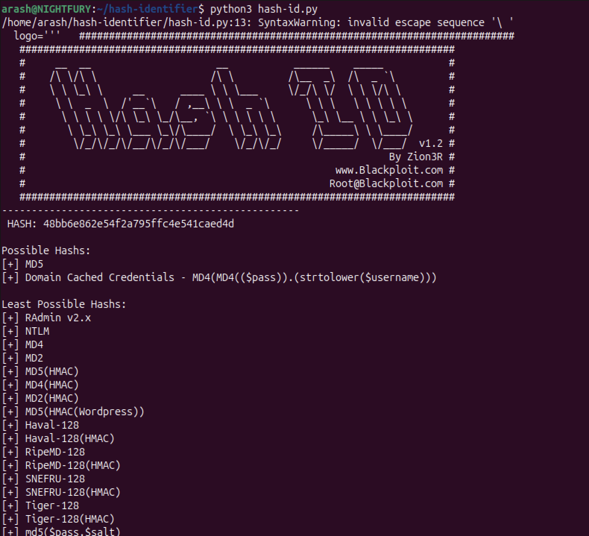
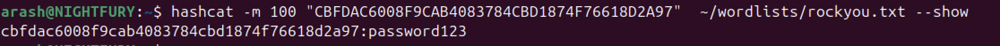
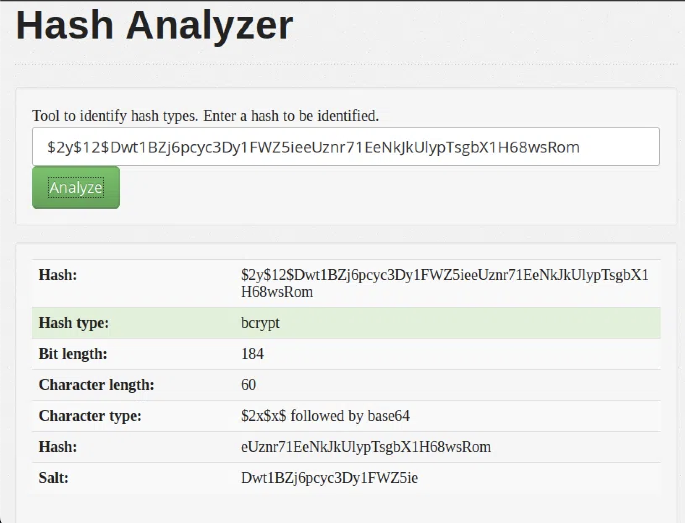
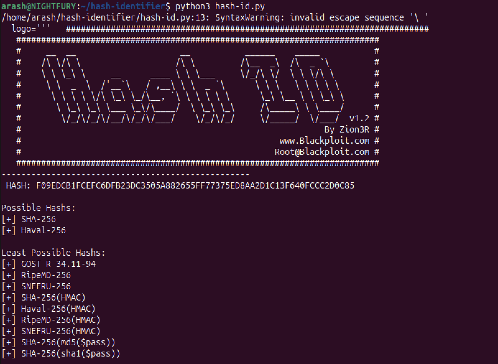
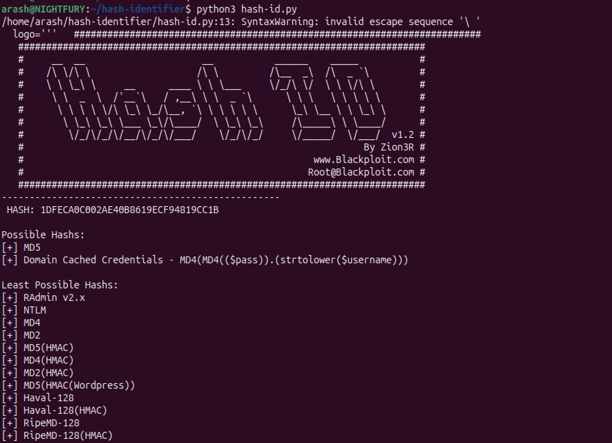
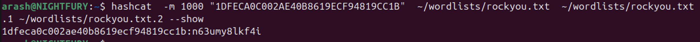

>> TryHackMe — 👾Crack The Hash Writeup👾

**Room:** Crack The Hash  

**Platform:** TryHackMe  

**Difficulty:** Easy  

**Points:** 320  

**Writeup by:** NIGHTFURY0X01 (Arash)  

---

## Overview

**Crack The Hash** is a TryHackMe room focused on identifying and cracking different types of password hashes.  
The challenge introduces common hash algorithms and demonstrates practical cracking techniques using:

- `hash-identifier`
- `Hash Analyzer / Hash Identification`
- `hashcat`
- `CrackStation`

The room is divided into **two levels**, each containing multiple hashes of increasing difficulty.

---

## Tools Used

- **hash-identifier** – Local hash identification tool  
- **hashcat** – Offline password cracking tool  
- **CrackStation** – Online hash lookup database  
- **rockyou.txt** – Common password wordlist  
- **hash cracking guide** : https://github.com/NIGHTFURY0X01/hash-cracking-guide
---

# LEVEL 1 :

---

## Hash #1 — MD5

**Hash**
```
48bb6e862e54f2a795ffc4e541caed4d
```

**Identification**

- MD5

**Hashcat Command**
```bash
hashcat -m 0 "48bb6e862e54f2a795ffc4e541caed4d" rockyou.txt
```


**Cracked**
```
easy
```

---

## Hash #2 — SHA1

**Hash**
```
CBFDAC6008F9CAB4083784CBD1874F76618D2A97
```

**Identification**
```
 HASH: CBFDAC6008F9CAB4083784CBD1874F76618D2A97

Possible Hashs:
[+]  SHA-1
[+]  MySQL5 - SHA-1(SHA-1($pass))

Least Possible Hashs:
[+]  Tiger-160
[+]  Haval-160
[+]  RipeMD-160
[+]  SHA-1(HMAC)
[+]  Tiger-160(HMAC)
[+]  RipeMD-160(HMAC)
[+]  Haval-160(HMAC)
[+]  SHA-1(MaNGOS)
[+]  SHA-1(MaNGOS2)
[+]  sha1($pass.$salt)
[+]  sha1($salt.$pass)
[+]  sha1($salt.md5($pass))
[+]  sha1($salt.md5($pass).$salt)
[+]  sha1($salt.sha1($pass))
[+]  sha1($salt.sha1($salt.sha1($pass)))
[+]  sha1($username.$pass)
[+]  sha1($username.$pass.$salt)
[+]  sha1(md5($pass))
[+]  sha1(md5($pass).$salt)
[+]  sha1(md5(sha1($pass)))
[+]  sha1(sha1($pass))
[+]  sha1(sha1($pass).$salt)
[+]  sha1(sha1($pass).substr($pass,0,3))
[+]  sha1(sha1($salt.$pass))
[+]  sha1(sha1(sha1($pass)))
[+]  sha1(strtolower($username).$pass)

   -------------------------------------------------------------------------
```
- SHA1

**Hashcat Command**
```bash
hashcat -m 100 "CBFDAC6008F9CAB4083784CBD1874F76618D2A97" rockyou.txt
```



**Cracked**
```
password123
```

---

## Hash #3 — SHA256

**Hash**
```
1C8BFE8F801D79745C4631D09FFF36C82AA37FC4CCE4FC946683D7B336B63032
```

**Identification**


- SHA256

**Hashcat Command**
```bash
hashcat -m 1400 "1C8BFE8F801D79745C4631D09FFF36C82AA37FC4CCE4FC946683D7B336B63032" rockyou.txt
```


**Cracked**
```
letmein
```

---

## Hash #4 — bcrypt

**Hash**
```
$2y$12$Dwt1BZj6pcyc3Dy1FWZ5ieeUznr71EeNkJkUlypTsgbX1H68wsRom
```

**Identification**


- bcrypt

**Hashcat Command**
+ hash.txt :
`$2y$12$Dwt1BZj6pcyc3Dy1FWZ5ieeUznr71EeNkJkUlypTsgbX1H68wsRom
`

```bash
hashcat -m 3200 hash.txt rockyou.txt
```


**Cracked**
```
bleh
```

> bcrypt is intentionally slow — cracking may take hours or days depending on hardware.

---

## Hash #5 — MD4

**Hash**
```
279412f945939ba78ce0758d3fd83daa
```

**Identification**


- MD4

**Hashcat Command**
```bash
hashcat -m 900 "279412f945939ba78ce0758d3fd83daa" rockyou.txt
```


**Cracked**
```
Eternity22
```

---

# LEVEL 2 :

---

## Hash #1 — SHA256

**Hash**
```
F09EDCB1FCEFC6DFB23DC3505A882655FF77375ED8AA2D1C13F640FCCC2D0C85
```


**Hashcat Command**
```bash
hashcat -m 1400 "F09EDCB1FCEFC6DFB23DC3505A882655FF77375ED8AA2D1C13F640FCCC2D0C85" ~/wordlists/rockyou.txt ~/wordlists/rockyou.txt.1 ~/wordlists/rockyou.txt.2
```


**Cracked**
```
paule
```

---

## Hash #2 — NTLM

**Hash**
```
1DFECA0C002AE40B8619ECF94819CC1B
```

**Identification**
- NTLM (commonly confused with MD5)



**Hashcat Command**
```bash
hashcat -m 1000
-M 1000 "1DFECA0C002AE40B8619ECF94819CC1B" ~/wordlists/rockyou.txt ~/wordlists/rockyou.txt.1 ~/wordlists/rockyou.txt.2
```


**Cracked**
```
n63umy8lkf4i
```

---

## Hash #3 — SHA512-crypt

**Hash**
```
$6$aReallyHardSalt$6WKUTqzq.UQQmrm0p/T7MPpMbGNnzXPMAXi4bJMl9be.cfi3/qxIf.hsGpS41BqMhSrHVXgMpdjS6xeKZAs02.
```

**Identification**
- sha512crypt (`$6$`)


**Hashcat Command**
```bash
-m 1800 sha512.hash rockyou.txt --session sha512
```

**Cracked**
```
$6$aReallyHardSalt$6WKUTqzq.UQQmrm0p/T7MPpMbGNnzXPMAXi4bJMl9be.cfi3/qxIf.hsGpS41BqMhSrHVXgMpdjS6xeKZAs02.:waka99

```

---

## Hash #4 — Salted SHA1

**Hash**
```
e5d8870e5bdd26602cab8dbe07a942c8669e56d6
```

**Salt**
```
tryhackme
```


**Hashcat Command**
```bash
hashcat -m 110 hash.txt rockyou.txt
```

**Cracked**
```
481616481616
```

---

## Conclusion

This room demonstrates:

- How misleading hash identification can be  
- Why correct hash modes in hashcat matter  
- The effectiveness of common wordlists  
- Why slow hashes like bcrypt and sha512crypt are safer  

---

## Key Hashcat Modes Used

| Hash Type | Mode |
|---------|------|
| MD5 | 0 |
| SHA1 | 100 |
| SHA256 | 1400 |
| SHA512-crypt | 1800 |
| bcrypt | 3200 |
| NTLM | 1000 |
| MD4 | 900 |
 

---

**Happy Hacking 👾👾**
